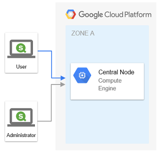

Single node Qlik Sense in GCP through Terraform
===

This Terraform project will deploy a Windows Server 2016 in Google Cloud Platform (GCP). Qlik Sense Enterprise February 2019 will then be downloaded, installed and enabled through a startup PS1 script.

## Prerequisites

* Valid Qlik Sense license
* [Terraform](https://www.terraform.io/downloads.html)
* [Google Cloud SDK](https://cloud.google.com/sdk/docs/downloads-interactive) 
* [Billing enabled GCP account](https://cloud.google.com/billing/docs/how-to/manage-billing-account)

## Setup GCP project and Service Account

The deployment requires a service account with correct associated roles. This can be setup manually in GCP Console or through Google Cloud SDK as show below.

1. Login to GCP  `gcloud auth login your@mail.com`
1. Create project with a new unique project id  `gcloud projects create --name='QSEfW Single Node'`
1. Take note of the project id. Use it instead of PROJECT_ID in all following commands. 
1. Set new project as active  `gcloud config set project qsefw-single-node-238003`
1. Add service account *qsefw-sa* to project  `gcloud iam service-accounts create qsefw-sa --display-name='QSEfW Service Account'`
1. Create GCP account file for the service account, and store in .secrets folder  `gcloud iam service-accounts keys create ./.secrets/account.json --iam-account qsefw-sa@qsefw-single-node-238003.iam.gserviceaccount.com` 
1. Bind service account to required roles 
    * Compute Engine Admin  `gcloud projects add-iam-policy-binding qsefw-single-node-238003 --member serviceAccount:qsefw-sa@qsefw-single-node-238003.iam.gserviceaccount.com --role roles/compute.admin`
    * Compute Network Admin  `gcloud projects add-iam-policy-binding qsefw-single-node-238003 --member serviceAccount:qsefw-sa@qsefw-single-node-238003.iam.gserviceaccount.com --role roles/compute.networkAdmin`
1. Enable required APIs. Following billing enablement link if required. 
    * Compute Engine API   `gcloud services enable compute.googleapis.com`

## Configuration

Terraform prompts for undefined variables during validation and execution. 

*.tfvars* files can be used to define variabel values, prior to Terrafrom validation and execution. *variables.tpl.tfvars* contains a template for required variables for this project. 

*.tfvars* can be picked up automatically by Terraform, if file is renamed as *.auto.tfvars*. 
`mv variables.tpl.tfvars variables.auto.tfvars` 

If not automated, *.tfvars* file is applied by reference through command parameter. 
`terraform plan -var-file="variables.tfvars"` 
`terraform apply -var-file="variables.tfvars"`

## Deploy

1. Login to GCP `gcloud auth login your@mail.com`
1. Initiate Terraform `terraform init`
1. Validate config `terraform plan`
1. Deploy GCP infrastructure and install Qlik Sense for Windows `terraform apply` 
1. Total deployment time is 15-20 minutes with a *n1-highmem-2* instance. Configuration passwords are generated by Terraform, and presented after successful deployment.  
1. Connect to Windows server through *central-node.rdp* using your Windows administrator credentials. Note, it can take several minutes before RDP has been enabled in the GCE instance. 

## Destroy

1. Completely remove current deployment `terraform destroy` 

## License

This project is provided "AS IS", without any warranty, under the MIT License - see the [LICENSE](LICENSE) file for details    
